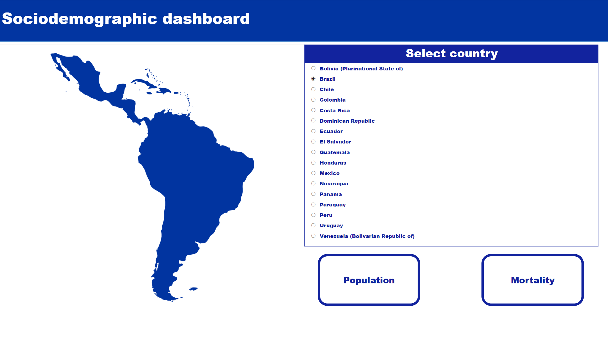

# Sociodemographic Data Extraction from the CEPAL API #
- A data extraction and processing tool that connects to the CEPAL (Economic Commission for Latin America and the Caribbean) API to retrieve, clean, and store sociodemographic data in CSV format for analysis and reporting.
---
# 🌐 Project Overview
- This project automates the retrieval of sociodemographic indicators from the CEPAL API, streamlines the data through preprocessing techniques, and exports the refined dataset into CSV files. This structured data can be used for further analysis, visualization, or storage.
---
# 🚀 Key Features #
- API Integration: Seamlessly connects to the CEPAL API to collect the latest sociodemographic data.
- Data Preprocessing: Cleans and organizes raw data for enhanced usability.
- CSV Export: Saves processed data in CSV format for easy access and analysis.
---
# 📖 Usage Instructions #
- Visit the CEPAL API Documentation for details on how to interact with the API.
- Use the main endpoint to retrieve a list of all indicator IDs.
- Add the retrieved indicator IDs to the indicators.csv file located in the Resources folder.
- Execute the script to fetch, process, and export the data.
---
# 📊 Dashboard images #

